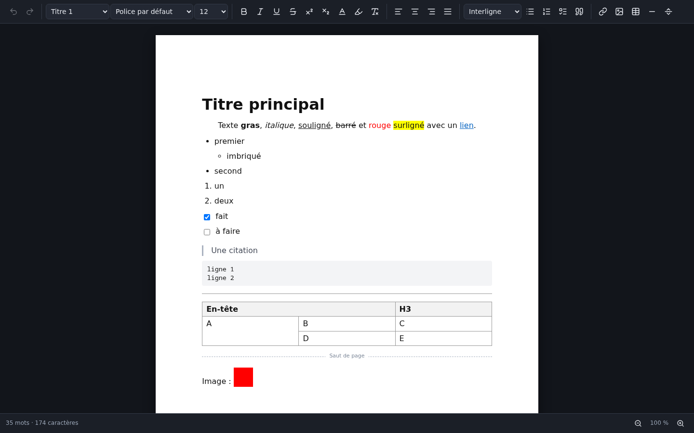

# Text to One

Un traitement de texte libre pour Windows et Linux.


Text to One est le premier logiciel d'une future suite bureautique libre.
**Le tableur et les présentations arrivent bientôt.**

| Application | État |
| --- | --- |
| Texte | disponible |
| Tableur | bientôt |
| Présentations | bientôt |

## Ce qu'il sait faire

- **Écrire** : titres, gras, italique, souligné, barré, exposant, indice, listes à puces, numérotées et à cocher, alignement, interligne, police, taille, couleurs, surlignage, liens, images, tableaux (avec fusion de cellules), citations, lignes de séparation, sauts de page.
- **Confort** : rechercher et remplacer, compteur de mots, zoom, thèmes clair et sombre, correcteur orthographique français, enregistrement automatique avec récupération après un plantage, documents récents.
- **Fichiers** : format propre `.tto` sans aucune perte ; ouverture des fichiers Word (`.docx`) ; export en `.docx`, PDF, page web, texte brut et Markdown.



### Ce qui n'est pas encore là

Les en-têtes et pieds de page, la table des matières, les notes de bas de page, les onglets et la vraie découpe en pages à l'écran (les sauts de page n'existent qu'à l'impression et dans le PDF).

### À propos de Word

Text to One lit et écrit les fichiers `.docx` : texte, titres, listes, tableaux, images, gras, italique, souligné, barré, couleurs, alignement. Il ne reprend pas les colonnes, les zones de texte, les styles personnalisés, le suivi des modifications, les en-têtes, les pieds de page ni les notes de bas de page, et il le signale à l'ouverture. Les anciens fichiers `.doc` ne sont pas pris en charge : enregistre-les d'abord en `.docx`.

## Installer

Les installateurs sont dans la page [Releases](../../releases) :

- **Windows** : `Text-to-One-Installation-x.y.z.exe`. Windows affichera « éditeur inconnu » : le programme n'est pas signé (la signature est payante). Clique sur « Informations complémentaires » puis « Exécuter quand même ».
- **Linux** : `Text-to-One-x.y.z.AppImage` (rends-le exécutable puis lance-le) ou `text-to-one_x.y.z_amd64.deb` (`sudo apt install ./text-to-one_x.y.z_amd64.deb`).

## Développer

Il faut Node.js 22 ou plus récent.

```bash
npm install
npm start            # fabrique puis lance l'application
npm test             # tests des formats, du contrôleur, de la recherche et des fichiers
npm run test:ui      # tests de l'interface dans un navigateur
npm run test:e2e     # tests de la vraie application (demande un écran)
npm run dist         # fabrique les installateurs dans release/
```

L'éditeur repose sur [TipTap](https://tiptap.dev) (ProseMirror), l'export Word sur [docx](https://docx.js.org), et l'application sur [Electron](https://www.electronjs.org).

## Licence

Text to One est un logiciel libre, distribué sous licence [GPL-3.0](LICENSE).
