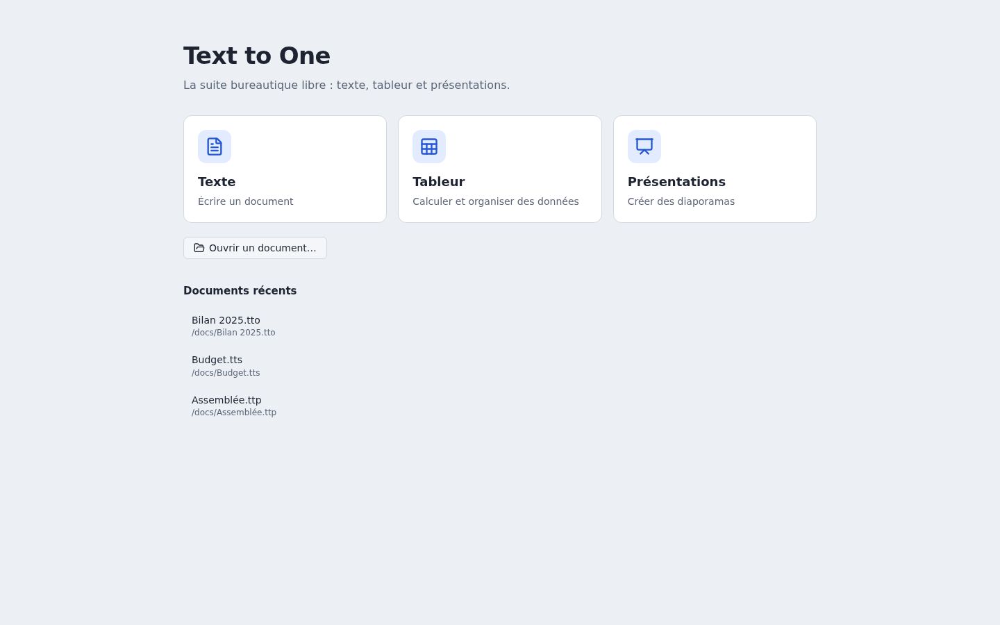
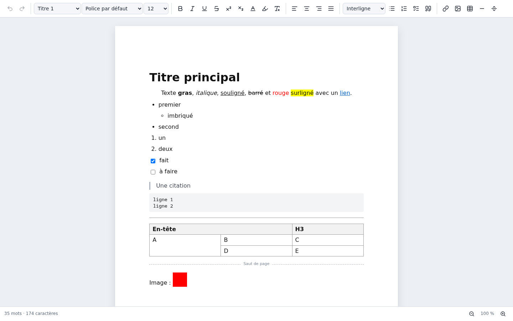
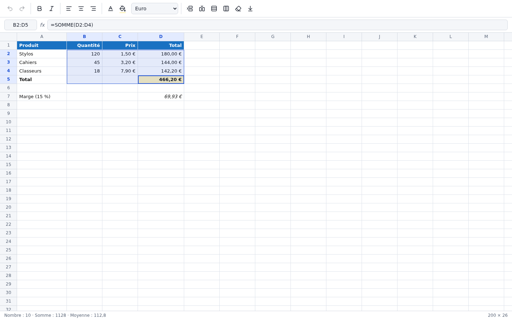
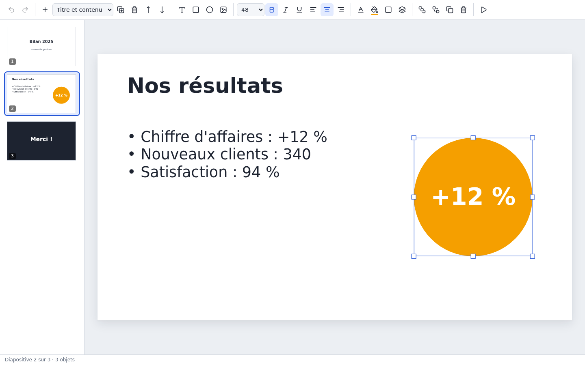

# Text to One

Une suite bureautique libre pour Windows et Linux : un traitement de texte, un tableur et un logiciel de présentations.



| Application | Ouvre | Enregistre et exporte |
| --- | --- | --- |
| **Texte** | `.tto`, Word (`.docx`) | `.tto`, Word, PDF, page web, texte brut, Markdown |
| **Tableur** | `.tts`, Excel (`.xlsx`), CSV | `.tts`, Excel, CSV |
| **Présentations** | `.ttp` | `.ttp`, PowerPoint (`.pptx`), PDF |

Tout est en français : les menus, l'interface, les noms de fonctions du tableur (`SOMME`, `SI`, `NB.SI`…), le correcteur orthographique.

## Texte



- **Écrire** : titres, gras, italique, souligné, barré, exposant, indice, listes à puces, numérotées et à cocher, alignement, interligne, police, taille, couleurs, surlignage, liens, images, tableaux (avec fusion de cellules), citations, lignes de séparation, sauts de page.
- **Confort** : rechercher et remplacer, compteur de mots, zoom, correcteur orthographique français, enregistrement automatique avec récupération après un plantage, documents récents.
- **Word** : texte, titres, listes, tableaux, images, gras, italique, souligné, barré, couleurs, alignement. Pas de colonnes, zones de texte, styles personnalisés, suivi des modifications, en-têtes, pieds de page ni notes de bas de page : Text to One le signale à l'ouverture. Les anciens fichiers `.doc` ne sont pas pris en charge.
- **Pas encore là** : en-têtes et pieds de page, table des matières, notes de bas de page, vraie découpe en pages à l'écran (les sauts de page n'existent qu'à l'impression et dans le PDF).

## Tableur



- **Formules en français** grâce au moteur libre [HyperFormula](https://hyperformula.handsontable.com) : plus de 380 fonctions (`SOMME`, `MOYENNE`, `SI`, `ET`, `NB.SI`, `ARRONDI`, `CONCATENER`…), références relatives et absolues (`$A$1`), plages, calcul automatique.
- **Feuille** : 200 lignes et 26 colonnes au départ, qui grandissent quand on descend ou qu'on insère ; seules les cellules visibles sont affichées, donc les grandes feuilles restent fluides.
- **Édition** : saisie dans la cellule ou dans la barre de formule, sélection au clavier et à la souris, statistiques de la sélection (nombre, somme, moyenne), copier-couper-coller (les références des formules se décalent), recopier vers le bas (`Ctrl+D`), insertion et suppression de lignes et de colonnes (les formules suivent), largeur de colonne réglable, annuler et rétablir.
- **Mise en forme** : gras, italique, alignement, couleur du texte et du fond, formats de nombres (entier, deux décimales, pourcentage, euro).
- **Excel et CSV** : les formules sont traduites entre le français et l'anglais dans les deux sens. Le CSV se lit et s'écrit à la française (`;`, virgule décimale, accents).
- **Limites** : une seule feuille par classeur (les autres sont ignorées avec un avertissement), pas de graphiques, pas de cellules fusionnées, pas de dates à l'import Excel (elles restent des nombres), pas d'export PDF.

## Présentations



- **Diapositives** en 16/9 : volet de miniatures, trois mises en page (titre, titre et contenu, vide), ajouter, dupliquer, supprimer, réordonner, fond en couleur.
- **Objets** : zones de texte, rectangles, ellipses (avec du texte), images. On les déplace, on les redimensionne avec les poignées, on écrit dedans en double-cliquant, on les met au premier plan ou à l'arrière-plan, on les duplique (`Ctrl+D`).
- **Mise en forme** : taille, gras, italique, souligné, alignement, couleurs du texte, du remplissage et du contour.
- **Présenter** en plein écran (`F5`) : flèches, espace ou clic pour avancer, Échap pour quitter.
- **PowerPoint** : l'export écrit un vrai `.pptx`. Text to One ne sait pas encore *ouvrir* un fichier PowerPoint.
- **Pas encore là** : animations, transitions, notes de l'orateur, thèmes, texte avec plusieurs styles dans une même zone, formes autres que le rectangle et l'ellipse.

## Installer

Les installateurs sont dans la page [Releases](../../releases) :

- **Windows** : `Text-to-One-Installation-x.y.z.exe`. Windows affichera « éditeur inconnu » : le programme n'est pas signé (la signature est payante). Clique sur « Informations complémentaires » puis « Exécuter quand même ».
- **Linux** : `Text-to-One-x.y.z.AppImage` (rends-le exécutable puis lance-le) ou `text-to-one_x.y.z_amd64.deb` (`sudo apt install ./text-to-one_x.y.z_amd64.deb`).

## Développer

Il faut Node.js 22 ou plus récent.

```bash
npm install
npm start            # fabrique puis lance l'application
npm test             # tests des formats, du tableur, des présentations, du contrôleur et des fichiers
npm run test:ui      # tests de l'interface dans un navigateur
npm run test:e2e     # tests de la vraie application (demande un écran)
npm run dist         # fabrique les installateurs dans release/
```

Le texte repose sur [TipTap](https://tiptap.dev) (ProseMirror) et [docx](https://docx.js.org) pour l'export Word, le tableur sur [HyperFormula](https://hyperformula.handsontable.com), les présentations sur [pptxgenjs](https://gitbrent.github.io/PptxGenJS/) pour l'export PowerPoint, et l'application sur [Electron](https://www.electronjs.org).

## Licence

Text to One est un logiciel libre, distribué sous licence [GPL-3.0](LICENSE).
